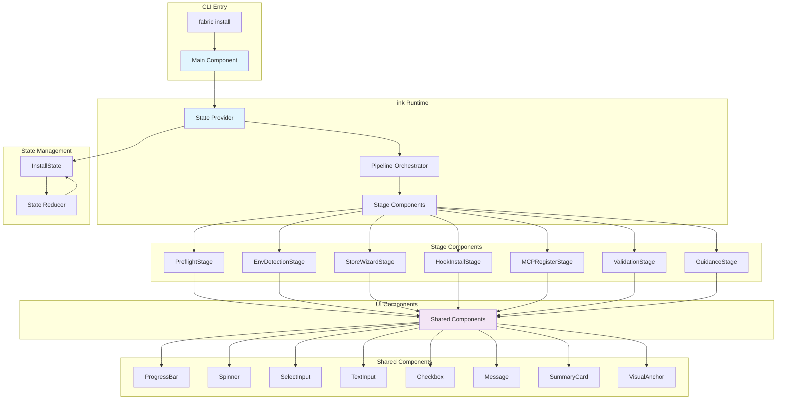

# ADR-002: ink TUI Architecture

## Status

**ACCEPTED** (SA-02 Locked)

## Context

The Fabric CLI requires an interactive terminal user interface for:
- Store onboarding wizard (multi-step form with validation)
- Client selection (checkbox list)
- Progress indication during long-running operations
- Error display with actionable guidance
- Summary card rendering

Current implementation uses imperative console.log calls with chalk for coloring, resulting in:
- Scattered UI logic across command handlers
- Inconsistent output formatting
- Difficult to test UI components
- No structured progress indication
- Limited accessibility (no focus management)

## Decision

We SHALL adopt **ink** (v4.0.0+) as the TUI framework with **@inkjs/ui** (v2.0.0+) for pre-built components.

### Architecture Overview



### Component Hierarchy

```tsx
<InstallApp>
  <StateProvider>
    <PipelineOrchestrator>
      {/* Stage components rendered based on state */}
      <StageRouter>
        <PreflightStage />
        <EnvDetectionStage />
        <StoreWizardStage />
        <HookInstallStage />
        <MCPRegisterStage />
        <ValidationStage />
        <GuidanceStage />
      </StageRouter>
      
      {/* Persistent UI elements */}
      <StatusBar />
      <ErrorBoundary>
        <ErrorDisplay />
      </ErrorBoundary>
    </PipelineOrchestrator>
  </StateProvider>
</InstallApp>
```

### State Model

```typescript
interface InstallState {
  // Pipeline control
  currentStage: Stage;
  stageHistory: StageResult[];
  isComplete: boolean;
  
  // Stage-specific data
  preflight: PreflightResult | null;
  environment: EnvironmentResult | null;
  store: StoreConfig | null;
  hooks: HookResult | null;
  mcp: MCPResult | null;
  validation: ValidationResult | null;
  
  // Error handling
  errors: ErrorInfo[];
  warnings: Warning[];
  
  // Metrics
  metrics: {
    startTime: number;
    stageDurations: Map<Stage, number>;
    retryCount: number;
  };
}

type Stage = 
  | 'preflight'
  | 'environment'
  | 'store-config'
  | 'hook-install'
  | 'mcp-register'
  | 'validation'
  | 'guidance';

interface StageResult {
  stage: Stage;
  status: 'pending' | 'running' | 'success' | 'warning' | 'error';
  duration?: number;
  error?: ErrorInfo;
  warning?: Warning;
}
```

### Component Design Patterns

#### 1. Stage Component Pattern

```tsx
interface StageComponentProps {
  state: InstallState;
  dispatch: Dispatch<InstallAction>;
  onComplete: (result: StageResult) => void;
  onError: (error: ErrorInfo) => void;
}

const PreflightStage: FC<StageComponentProps> = ({ state, dispatch, onComplete, onError }) => {
  useEffect(() => {
    runPreflightChecks()
      .then(onComplete)
      .catch(onError);
  }, []);
  
  return (
    <Box flexDirection="column">
      <VisualAnchor stage="preflight" />
      <Spinner type="dots" text="Running preflight checks..." />
    </Box>
  );
};
```

#### 2. Interactive Wizard Pattern

```tsx
const StoreWizardStage: FC<StageComponentProps> = ({ state, dispatch }) => {
  const [step, setStep] = useState<'select' | 'create' | 'confirm'>('select');
  
  const handleStoreSelect = (storeId: string) => {
    dispatch({ type: 'SELECT_STORE', payload: storeId });
    setStep('confirm');
  };
  
  return (
    <Box flexDirection="column">
      <VisualAnchor stage="store-config" />
      {step === 'select' && (
        <StoreSelection onSelect={handleStoreSelect} />
      )}
      {step === 'create' && (
        <StoreCreation onCreated={handleStoreSelect} />
      )}
      {step === 'confirm' && (
        <StoreConfirmation store={state.store} />
      )}
    </Box>
  );
};
```

#### 3. Progress Pattern

```tsx
const HookInstallStage: FC<StageComponentProps> = ({ state, dispatch, onComplete }) => {
  const [progress, setProgress] = useState({ current: 0, total: 0 });
  
  useEffect(() => {
    const hooks = state.hooks?.enabledHooks || [];
    setProgress({ current: 0, total: hooks.length });
    
    installHooks(hooks, (current) => {
      setProgress(prev => ({ ...prev, current }));
    }).then(onComplete);
  }, []);
  
  return (
    <Box flexDirection="column">
      <VisualAnchor stage="hook-install" />
      <ProgressBar 
        value={progress.current} 
        max={progress.total}
        label="Installing hooks"
      />
    </Box>
  );
};
```

### Component Library Selection

| Component | @inkjs/ui | Usage |
|-----------|-----------|-------|
| `SelectInput` | Yes | Store selection, client selection |
| `TextInput` | Yes | Store path input, remote URL |
| `Checkbox` | Yes | Multi-client selection |
| `Spinner` | Yes | Long-running operations |
| `ProgressBar` | Custom | Hook installation progress |
| `SummaryCard` | Custom | Final summary display |
| `VisualAnchor` | Custom | Stage indicator |
| `Message` | Custom | Error/warning display |

### Accessibility Considerations

1. **Focus Management**: ink handles focus automatically for interactive components
2. **Screen Reader**: All interactive elements have labels
3. **Color Contrast**: Chalk colors meet WCAG AA contrast ratios
4. **Keyboard Navigation**: All interactions keyboard-accessible

### Non-Interactive Mode

```tsx
const InstallApp: FC = () => {
  const { nonInteractive, yes } = useConfig();
  
  if (nonInteractive || yes) {
    return <NonInteractivePipeline />;
  }
  
  return <InteractivePipeline />;
};
```

Non-interactive mode renders static output without ink:
- Uses `ora` for spinners
- Uses `console.log` for output
- No interactivity, accepts all defaults or CLI flags

## Alternatives Considered

### Alternative 1: Continue with Imperative console.log
**Pros**: No new dependencies, familiar to all developers
**Cons**: Does not address any requirements (testability, consistency, accessibility)
**Decision**: Rejected

### Alternative 2: Use enquirer for prompts
**Pros**: Lightweight, good prompt library
**Cons**: Not React-based, no declarative composition, limited to prompts
**Decision**: Rejected — ink provides better architecture for complex UIs

### Alternative 3: Use blessed/blessed-contrib
**Pros**: Full terminal UI toolkit, widgets, layout
**Cons**: Complex API, maintenance concerns, overkill for this use case
**Decision**: Rejected — ink is simpler and React-based

### Alternative 4: Custom TUI framework
**Pros**: Tailored to Fabric needs
**Cons**: Significant development effort, NIH syndrome
**Decision**: Rejected — ink is battle-tested and actively maintained

## Consequences

### Positive
- **Declarative UI**: React components easier to reason about
- **Testability**: Components can be tested with ink-testing-library
- **Consistency**: Shared components ensure visual consistency
- **Accessibility**: Built-in focus management and ARIA patterns
- **Composability**: Easy to add new stages or UI elements

### Negative
- **Learning Curve**: React/ink patterns for contributors
- **Bundle Size**: ink adds ~200KB to bundle
- **Runtime Overhead**: React reconciliation overhead (minimal, < 5ms per render)

### Neutral
- **Node.js Version**: Requires Node.js >= 16.8.0 (already our minimum)
- **Windows Support**: ink works well on Windows Terminal, cmd.exe, PowerShell

## Implementation Notes

1. **Directory Structure**:
```
src/
  cli/
    install/
      index.tsx              # Entry point
      InstallApp.tsx         # Root component
      StateProvider.tsx     # State management
      stages/
        PreflightStage.tsx
        EnvDetectionStage.tsx
        StoreWizardStage.tsx
        HookInstallStage.tsx
        MCPRegisterStage.tsx
        ValidationStage.tsx
        GuidanceStage.tsx
      components/
        ProgressBar.tsx
        SummaryCard.tsx
        VisualAnchor.tsx
        Message.tsx
```

2. **Testing Strategy**:
   - Unit tests for state logic
   - Component tests with `ink-testing-library`
   - Integration tests with full pipeline mock

3. **Performance Optimization**:
   - Use `useMemo` for expensive computations
   - Minimize re-renders with `React.memo`
   - Lazy load heavy components

## References

- **SA-02**: Original brainstorm decision
- **ink Documentation**: https://github.com/vadimdemedes/ink
- **@inkjs/ui Documentation**: https://github.com/inkjs/ink-ui
- **ADR-001**: Stage definitions
- **ADR-003**: OutputRenderer integration
- **UI-01**: Visual anchor design
- **UI-02**: Summary card design