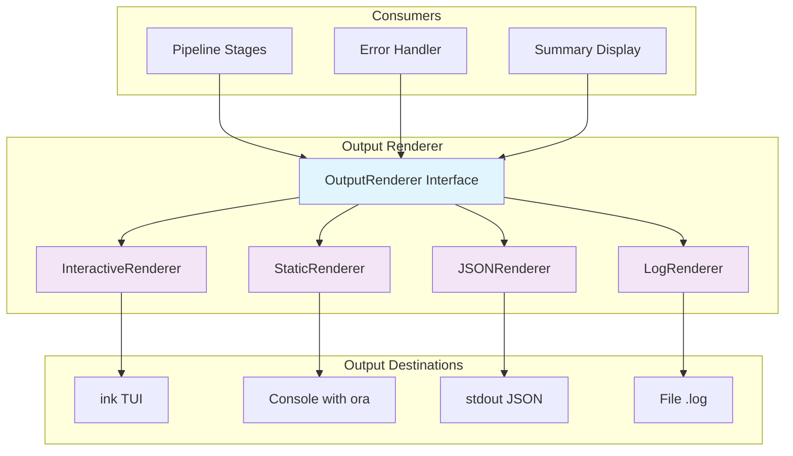

# ADR-003: Output Renderer Unification

## Status

**ACCEPTED** (SA-04 Locked)

## Context

The Fabric CLI has multiple output consumers:
- **Interactive TUI**: ink-based React components during install
- **Non-interactive mode**: Static console output with progress indicators
- **JSON output**: Machine-readable format for CI/CD (`--json` flag)
- **Log files**: Structured logging for debugging (`--log-file` flag)

Current implementation has output logic scattered across:
- Command handlers directly calling `console.log`
- Different formatting in each stage
- No unified error display
- Inconsistent JSON schema

## Decision

We SHALL implement a **unified OutputRenderer** interface with multiple output strategies:



### Interface Definition

```typescript
interface OutputRenderer {
  // Lifecycle
  start(config: OutputConfig): void;
  end(): void;
  
  // Stage rendering
  stageStart(stage: Stage): void;
  stageProgress(stage: Stage, progress: Progress): void;
  stageComplete(stage: Stage, result: StageResult): void;
  stageError(stage: Stage, error: ErrorInfo): void;
  
  // Message rendering
  info(message: string): void;
  success(message: string): void;
  warning(message: string, details?: string): void;
  error(message: string, error: ErrorInfo): void;
  
  // Interactive prompts (only in interactive mode)
  prompt<T>(prompt: PromptConfig): Promise<T>;
  
  // Summary rendering
  summary(summary: InstallSummary): void;
  
  // Structured output
  json(data: Record<string, unknown>): void;
  log(event: LogEvent): void;
}

interface OutputConfig {
  interactive: boolean;
  json: boolean;
  logFile?: string;
  verbose: boolean;
  color: boolean;
}

interface Progress {
  current: number;
  total: number;
  message?: string;
}

interface InstallSummary {
  store: StoreConfig;
  clients: ClientType[];
  hooks: string[];
  mcp: MCPRegistration[];
  duration: number;
  nextSteps: string[];
}

interface LogEvent {
  timestamp: string;
  level: 'debug' | 'info' | 'warn' | 'error';
  message: string;
  stage?: Stage;
  data?: Record<string, unknown>;
}
```

### Renderer Implementations

#### 1. InteractiveRenderer (ink TUI)

```typescript
class InteractiveRenderer implements OutputRenderer {
  private app: ReturnType<typeof render>;
  
  start(config: OutputConfig): void {
    this.app = render(<InstallApp config={config} />);
  }
  
  stageStart(stage: Stage): void {
    // Dispatch to ink state
    dispatch({ type: 'STAGE_START', payload: { stage } });
  }
  
  stageProgress(stage: Stage, progress: Progress): void {
    dispatch({ type: 'STAGE_PROGRESS', payload: { stage, progress } });
  }
  
  stageComplete(stage: Stage, result: StageResult): void {
    dispatch({ type: 'STAGE_COMPLETE', payload: { stage, result } });
  }
  
  stageError(stage: Stage, error: ErrorInfo): void {
    dispatch({ type: 'STAGE_ERROR', payload: { stage, error } });
  }
  
  async prompt<T>(prompt: PromptConfig): Promise<T> {
    return new Promise((resolve) => {
      dispatch({ type: 'PROMPT_SHOW', payload: { prompt, resolve } });
    });
  }
  
  summary(summary: InstallSummary): void {
    dispatch({ type: 'SHOW_SUMMARY', payload: summary });
  }
  
  end(): void {
    this.app?.unmount();
  }
}
```

#### 2. StaticRenderer (Console with ora)

```typescript
class StaticRenderer implements OutputRenderer {
  private spinner: ora.Ora | null = null;
  private currentStage: Stage | null = null;
  
  stageStart(stage: Stage): void {
    this.currentStage = stage;
    this.spinner = ora(stageLabels[stage]).start();
  }
  
  stageProgress(stage: Stage, progress: Progress): void {
    const percent = Math.round((progress.current / progress.total) * 100);
    this.spinner?.text = `${stageLabels[stage]} (${percent}%)`;
  }
  
  stageComplete(stage: Stage, result: StageResult): void {
    this.spinner?.succeed();
    this.spinner = null;
  }
  
  stageError(stage: Stage, error: ErrorInfo): void {
    this.spinner?.fail(error.message);
    this.spinner = null;
    
    // Print actionable error
    console.error(chalk.red(`Error: ${error.message}`));
    if (error.action) {
      console.error(chalk.yellow(`Action: ${error.action}`));
    }
  }
  
  summary(summary: InstallSummary): void {
    console.log(boxen(
      formatSummary(summary),
      { padding: 1, borderColor: 'green' }
    ));
  }
}
```

#### 3. JSONRenderer (Machine-readable)

```typescript
class JSONRenderer implements OutputRenderer {
  stageStart(stage: Stage): void {
    this.emit({ type: 'stage_start', stage, timestamp: Date.now() });
  }
  
  stageComplete(stage: Stage, result: StageResult): void {
    this.emit({ type: 'stage_complete', stage, result, timestamp: Date.now() });
  }
  
  stageError(stage: Stage, error: ErrorInfo): void {
    this.emit({ type: 'stage_error', stage, error: error.toJSON(), timestamp: Date.now() });
  }
  
  summary(summary: InstallSummary): void {
    this.emit({ type: 'install_complete', summary, timestamp: Date.now() });
  }
  
  private emit(event: object): void {
    console.log(JSON.stringify(event));
  }
}
```

#### 4. LogRenderer (File logging)

```typescript
class LogRenderer implements OutputRenderer {
  private logStream: fs.WriteStream;
  
  constructor(logFile: string) {
    this.logStream = fs.createWriteStream(logFile, { flags: 'a' });
  }
  
  log(event: LogEvent): void {
    this.logStream.write(JSON.stringify({
      ...event,
      timestamp: event.timestamp || new Date().toISOString(),
    }) + '\n');
  }
  
  stageStart(stage: Stage): void {
    this.log({
      level: 'info',
      message: `Stage started: ${stage}`,
      stage,
    });
  }
  
  end(): void {
    this.logStream.end();
  }
}
```

### Composite Renderer

For multiple output destinations, use a composite pattern:

```typescript
class CompositeRenderer implements OutputRenderer {
  private renderers: OutputRenderer[];
  
  constructor(renderers: OutputRenderer[]) {
    this.renderers = renderers;
  }
  
  stageStart(stage: Stage): void {
    this.renderers.forEach(r => r.stageStart(stage));
  }
  
  stageComplete(stage: Stage, result: StageResult): void {
    this.renderers.forEach(r => r.stageComplete(stage, result));
  }
  
  // ... delegate all methods
}

// Factory function
function createRenderer(config: OutputConfig): OutputRenderer {
  const renderers: OutputRenderer[] = [];
  
  if (config.json) {
    renderers.push(new JSONRenderer());
  } else if (config.interactive) {
    renderers.push(new InteractiveRenderer());
  } else {
    renderers.push(new StaticRenderer());
  }
  
  if (config.logFile) {
    renderers.push(new LogRenderer(config.logFile));
  }
  
  return renderers.length === 1 
    ? renderers[0] 
    : new CompositeRenderer(renderers);
}
```

### Error Message Formatting

All renderers MUST use consistent error formatting:

```typescript
interface ErrorInfo {
  code: string;           // e.g., 'E_NO_PERMISSION'
  message: string;        // User-friendly message
  action?: string;         // Actionable fix
  details?: string;        // Technical details (shown in verbose mode)
  cause?: Error;           // Original error
}

// Example error
{
  code: 'E_HOOK_PERMISSION',
  message: 'Cannot write hook file to .claude/hooks/',
  action: 'Run: chmod +w .claude/hooks/ or check directory permissions',
  details: 'EACCES: permission denied, open .claude/hooks/session-start.cjs',
}
```

## Alternatives Considered

### Alternative 1: No abstraction, direct console.log
**Pros**: Simple, no overhead
**Cons**: Does not address any requirements
**Decision**: Rejected

### Alternative 2: Single renderer with flags
**Pros**: Simpler interface
**Cons**: Tight coupling, difficult to test, cannot combine outputs
**Decision**: Rejected — composite pattern provides flexibility

### Alternative 3: Event-based architecture
**Pros**: Decoupled, extensible
**Cons**: More complex, over-engineering for current needs
**Decision**: Rejected — interface pattern is sufficient

## Consequences

### Positive
- **Consistency**: Unified error formatting, progress display
- **Testability**: Mock renderer in unit tests
- **Flexibility**: Easy to add new output formats (e.g., markdown)
- **Composability**: Multiple outputs simultaneously (TUI + log file)
- **CI/CD Friendly**: JSON output for machine parsing

### Negative
- **Abstraction Layer**: Additional interface to maintain
- **Bundle Size**: ora dependency for static renderer

### Neutral
- **Runtime Overhead**: Minimal, single interface call per output

## Implementation Notes

1. **Error Codes**: Use consistent error code format `E_<CATEGORY>_<ISSUE>`
2. **Verbose Mode**: Show `details` field when `--verbose` flag present
3. **Color Detection**: Respect `NO_COLOR` environment variable
4. **Line Width**: Detect terminal width, wrap accordingly
5. **Streaming**: JSON output should flush immediately (not buffer)

## References

- **SA-04**: Original brainstorm decision
- **ADR-001**: Stage definitions
- **ADR-002**: ink TUI integration
- **error-handling.md**: Error classification details
- **observability.md**: Log event specification