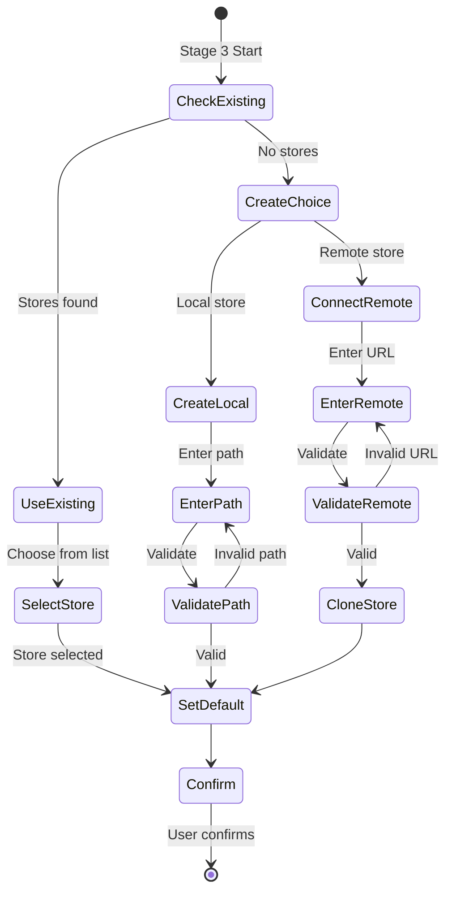

# ADR-004: Store Onboarding Wizard

## Status

**ACCEPTED** (UX-01 Locked)

## Context

Fabric CLI supports multiple store configurations:
- **Local stores**: `~/.fabric/stores/<id>/`
- **Remote stores**: Git repositories with knowledge base
- **Co-located stores**: `.fabric/` within project directory (legacy)

Users need guidance through store setup decisions:
1. Should I use an existing store or create new?
2. Where should the store be located?
3. Should this be a team store or personal?
4. How do I connect to an existing remote store?

Current experience:
- `fabric install` assumes co-located store (`.fabric/`)
- No interactive wizard for store creation
- Remote store connection requires manual config editing
- No guidance on team vs personal store

## Decision

We SHALL implement a **Store Onboarding Wizard** as Stage 3 of the install pipeline:



### Wizard States

#### State 1: Check Existing Stores

```typescript
interface ExistingStoresCheck {
  hasStores: boolean;
  stores: {
    id: string;
    path: string;
    type: 'local' | 'remote';
    isDefault: boolean;
    entryCount: number;
  }[];
  recommendation: 'use-existing' | 'create-new' | null;
}
```

**Detection Logic**:
1. Scan `~/.fabric/stores/` for existing stores
2. Check `.fabric/` for co-located store
3. Read store metadata from `store.json`

**Output**:
- If stores exist: Show selection list
- If no stores: Show create/connect choice

#### State 2: Store Selection

```tsx
const StoreSelection: FC<Props> = ({ stores, onSelect }) => {
  const items = stores.map(s => ({
    label: `${s.id} (${s.entryCount} entries)${s.isDefault ? ' [default]' : ''}`,
    value: s.id,
  }));
  
  return (
    <Box flexDirection="column">
      <Text bold>Select a store:</Text>
      <SelectInput items={items} onSelect={onSelect} />
    </Box>
  );
};
```

**Keyboard Navigation**:
- `↑/↓`: Navigate store list
- `Enter`: Select store
- `Esc`: Go back to create choice

#### State 3: Create New Store

```tsx
const CreateStoreFlow: FC<Props> = ({ onComplete }) => {
  const [step, setStep] = useState<'type' | 'path' | 'remote' | 'name'>('type');
  const [config, setConfig] = useState<Partial<StoreConfig>>({});
  
  return (
    <Box flexDirection="column">
      {step === 'type' && (
        <SelectInput
          items={[
            { label: 'Create local store', value: 'local' },
            { label: 'Connect remote store', value: 'remote' },
          ]}
          onSelect={(item) => {
            setConfig({ type: item.value });
            setStep(item.value === 'local' ? 'path' : 'remote');
          }}
        />
      )}
      
      {step === 'path' && (
        <TextInput
          label="Store path:"
          placeholder="~/.fabric/stores/my-store"
          onSubmit={(path) => {
            setConfig(c => ({ ...c, path }));
            setStep('name');
          }}
        />
      )}
      
      {step === 'remote' && (
        <TextInput
          label="Remote URL:"
          placeholder="https://github.com/org/knowledge-base"
          onSubmit={(url) => {
            setConfig(c => ({ ...c, remote: url }));
            setStep('name');
          }}
        />
      )}
      
      {step === 'name' && (
        <TextInput
          label="Store name:"
          placeholder="my-team-kb"
          onSubmit={(name) => {
            onComplete({ ...config, id: name });
          }}
        />
      )}
    </Box>
  );
};
```

#### State 4: Set as Default

```tsx
const SetDefaultPrompt: FC<Props> = ({ store, onConfirm }) => {
  return (
    <Box flexDirection="column">
      <ConfirmInput
        label={`Set "${store.id}" as default store?`}
        default={true}
        onConfirm={(isDefault) => onConfirm({ ...store, isDefault })}
      />
    </Box>
  );
};
```

#### State 5: Confirmation Summary

```tsx
const StoreConfirmation: FC<Props> = ({ store, onConfirm, onEdit }) => {
  return (
    <Box flexDirection="column">
      <Text bold>Store Configuration Summary:</Text>
      <Box marginLeft={2}>
        <Text>ID: {store.id}</Text>
      </Box>
      <Box marginLeft={2}>
        <Text>Path: {store.path}</Text>
      </Box>
      <Box marginLeft={2}>
        <Text>Type: {store.type}</Text>
      </Box>
      <Box marginLeft={2}>
        <Text>Default: {store.isDefault ? 'Yes' : 'No'}</Text>
      </Box>
      
      <Box marginTop={1}>
        <Text dimColor>Press Enter to confirm, E to edit</Text>
      </Box>
      
      <KeyInput
        onEnter={() => onConfirm(store)}
        onKey={{ key: 'e' }>(() => onEdit())}
      />
    </Box>
  );
};
```

### Non-Interactive Mode

When `--yes` or `--non-interactive` flag is set:

```typescript
async function createStoreNonInteractive(flags: CLIFlags): Promise<StoreConfig> {
  // Priority order:
  // 1. --store <id> - Use existing store
  // 2. --create-store <path> - Create local store
  // 3. --connect-store <url> - Connect remote store
  // 4. Default: Use default store if exists, else create new
  
  if (flags.store) {
    const store = await loadStore(flags.store);
    if (!store) throw new Error(`Store not found: ${flags.store}`);
    return store;
  }
  
  if (flags.createStore) {
    return await createStore({
      path: flags.createStore,
      id: basename(flags.createStore),
      type: 'local',
      isDefault: true,
    });
  }
  
  if (flags.connectStore) {
    return await connectRemoteStore({
      url: flags.connectStore,
      id: basename(flags.connectStore, '.git'),
      type: 'remote',
      isDefault: true,
    });
  }
  
  // Default behavior
  const defaultStore = await findDefaultStore();
  if (defaultStore) return defaultStore;
  
  // Create new default store
  return await createStore({
    path: DEFAULT_STORE_PATH,
    id: 'default',
    type: 'local',
    isDefault: true,
  });
}
```

### Validation Rules

```typescript
interface StoreValidation {
  path: {
    rules: [
      'Must be absolute path or start with ~/',
      'Must not already exist (for new stores)',
      'Parent directory must exist',
      'Must be writable',
    ];
    validate: (path: string) => ValidationResult;
  };
  
  remote: {
    rules: [
      'Must be valid Git URL',
      'Must be accessible (public or with credentials)',
      'Must contain fabric store structure',
    ];
    validate: (url: string) => Promise<ValidationResult>;
  };
  
  id: {
    rules: [
      'Must be lowercase alphanumeric with hyphens',
      'Must be 1-64 characters',
      'Must be unique within stores',
    ];
    validate: (id: string) => ValidationResult;
  };
}
```

### Error Handling in Wizard

```tsx
const ValidatedInput: FC<Props> = ({ label, validate, onSubmit }) => {
  const [value, setValue] = useState('');
  const [error, setError] = useState<string | null>(null);
  
  const handleSubmit = async () => {
    const result = await validate(value);
    if (result.valid) {
      onSubmit(value);
    } else {
      setError(result.error);
    }
  };
  
  return (
    <Box flexDirection="column">
      <TextInput label={label} value={value} onChange={setValue} />
      {error && (
        <Box marginLeft={2}>
          <Text color="red">{error}</Text>
        </Box>
      )}
    </Box>
  );
};
```

## Alternatives Considered

### Alternative 1: Single-step prompts (no wizard)
**Pros**: Simpler implementation, faster for power users
**Cons**: No guided flow, overwhelming for new users, no validation feedback
**Decision**: Rejected — violates UX-01 guidance requirement

### Alternative 2: External configuration file
**Pros**: Declarative, version-controllable
**Cons**: Requires manual editing, no guided experience
**Decision**: Rejected — can be additive later for advanced users

### Alternative 3: Web-based wizard
**Pros**: Richer UI, better for complex configurations
**Cons**: Requires browser, more complex, not CLI-native
**Decision**: Rejected — CLI should be self-contained

## Consequences

### Positive
- **Guided Experience**: New users get clear choices
- **Validation**: Immediate feedback on invalid inputs
- **Flexibility**: Supports all store scenarios
- **Non-interactive Mode**: Power users can skip wizard

### Negative
- **Implementation Effort**: Multi-step wizard with state management
- **Longer Flow**: More steps than simple prompt
- **Maintenance**: More UI code to maintain

### Neutral
- **Bundle Size**: ink components add ~50KB

## Implementation Notes

1. **State Machine**: Use xstate for wizard flow (visualizable, testable)
2. **Default Values**: Remember last choices in `~/.fabric/config.json`
3. **Keyboard Shortcuts**: Document in help text (`?` for help)
4. **Accessibility**: Ensure all inputs have labels for screen readers
5. **Cancellability**: `Esc` key returns to previous step

## References

- **UX-01**: Original brainstorm decision
- **ADR-001**: Stage 3 context
- **ADR-002**: ink component patterns
- **ADR-003**: OutputRenderer integration
- **config-model.md**: Store config schema