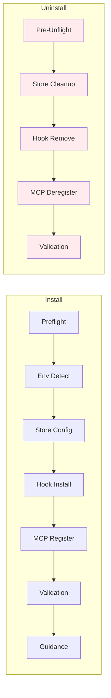

# ADR-005: Uninstall Symmetry

## Status

**ACCEPTED** (SA-03 Locked)

## Context

The current `fabric uninstall` command is incomplete:
- Removes hooks but leaves MCP registrations
- Does not clean up store bindings
- Leaves orphaned config files
- No validation of what will be removed
- No rollback if uninstall fails mid-way

Users expect `uninstall` to be the inverse of `install`:
- Remove what was added
- Keep what was already there
- Clean state after uninstall
- Symmetric to install flow

## Decision

We SHALL implement **symmetric uninstall** as a 5-stage pipeline that mirrors install:



### Symmetry Matrix

| Install Stage | Uninstall Stage | Symmetry Type |
|---------------|-----------------|---------------|
| Preflight Check | Pre-Unflight Check | Mirror |
| Environment Detection | (Implicit) | N/A |
| Store Configuration | Store Binding Cleanup | Inverse |
| Hook Installation | Hook Removal | Inverse |
| MCP Registration | MCP Deregistration | Inverse |
| Validation | Validation | Mirror |
| Post-Setup Guidance | (None) | N/A |

### Stage Definitions

#### Stage 1: Pre-Unflight Check

**Purpose**: Validate uninstall prerequisites and warn about data loss.

**Checks**:
- `.fabric/` exists in project directory
- At least one client has Fabric hooks registered
- At least one client has Fabric MCP registered
- User confirmation for data removal

**User Confirmation**:
```
╔═══════════════════════════════════════════════════════════════╗
║                      Uninstall Fabric                         ║
╠═══════════════════════════════════════════════════════════════╣
║  This will remove:                                            ║
║  • Hook files from: .claude/hooks/, .cursor/hooks/            ║
║  • MCP registrations from: .claude/settings.json, etc.       ║
║  • Store binding: .fabric/store-binding.json                  ║
║                                                               ║
║  Your knowledge base stores will NOT be deleted.              ║
║  They remain at: ~/.fabric/stores/                           ║
║                                                               ║
║  Continue? [y/N]                                              ║
╚═══════════════════════════════════════════════════════════════╝
```

**Non-Interactive Mode**:
- Requires `--yes` flag to proceed without confirmation
- `--dry-run` flag shows what would be removed without making changes

#### Stage 2: Store Binding Cleanup

**Purpose**: Remove project-to-store bindings, not stores themselves.

**Operations**:
1. Read `.fabric/store-binding.json`
2. Remove `.fabric/` directory (only if it contains only binding files)
3. Keep store data intact at `~/.fabric/stores/`

**Binding File Structure**:
```json
// .fabric/store-binding.json
{
  "storeId": "my-team-kb",
  "boundAt": "2026-06-06T10:00:00Z",
  "projectPath": "/path/to/project"
}
```

**Cleanup Logic**:
```typescript
async function cleanupStoreBinding(projectPath: string): Promise<CleanupResult> {
  const bindingFile = path.join(projectPath, '.fabric', 'store-binding.json');
  
  if (!fs.existsSync(bindingFile)) {
    return { status: 'skipped', reason: 'No binding file found' };
  }
  
  const binding = JSON.parse(fs.readFileSync(bindingFile, 'utf-8'));
  
  // Remove .fabric/ directory (only if it's a binding-only directory)
  const fabricDir = path.join(projectPath, '.fabric');
  const fabricContents = fs.readdirSync(fabricDir);
  
  // Check if .fabric/ contains only binding-related files
  const bindingFiles = ['store-binding.json', 'agents.meta.json'];
  const isBindingOnly = fabricContents.every(f => bindingFiles.includes(f));
  
  if (isBindingOnly) {
    fs.removeSync(fabricDir);
    return { status: 'removed', storeId: binding.storeId };
  } else {
    // Keep .fabric/ if it contains user knowledge
    fs.removeSync(bindingFile);
    return { status: 'binding-removed', storeId: binding.storeId, keptDir: true };
  }
}
```

**Output**:
```typescript
interface StoreCleanupResult {
  status: 'removed' | 'binding-removed' | 'skipped';
  storeId?: string;
  reason?: string;
  keptDir?: boolean;  // True if .fabric/ kept due to user knowledge
}
```

#### Stage 3: Hook Removal

**Purpose**: Remove Fabric hooks from client directories.

**Removal Logic**:
```typescript
async function removeHooks(clients: ClientType[]): Promise<HookRemovalResult[]> {
  const results: HookRemovalResult[] = [];
  
  for (const client of clients) {
    const hookDir = getHookDirectory(client);
    const hooks = ['session-start.cjs', 'pre-tool-use.cjs', 'post-tool-use.cjs'];
    
    for (const hook of hooks) {
      const hookPath = path.join(hookDir, hook);
      
      if (fs.existsSync(hookPath)) {
        // Verify it's a Fabric hook (check header comment)
        const content = fs.readFileSync(hookPath, 'utf-8');
        if (isFabricHook(content)) {
          fs.removeSync(hookPath);
          results.push({ client, hook, status: 'removed' });
        } else {
          results.push({ client, hook, status: 'skipped', reason: 'Not a Fabric hook' });
        }
      }
    }
  }
  
  return results;
}
```

**Safety Checks**:
- Only remove files with Fabric header comment
- Skip unknown files in hook directories
- Log all removals for rollback

#### Stage 4: MCP Deregistration

**Purpose**: Remove Fabric MCP server from client configs.

**Deregistration Logic**:
```typescript
async function deregisterMCP(clients: ClientType[]): Promise<MCPResult[]> {
  const results: MCPResult[] = [];
  
  for (const client of clients) {
    const configPath = getMCPConfigPath(client);
    
    if (!fs.existsSync(configPath)) {
      results.push({ client, status: 'skipped', reason: 'Config not found' });
      continue;
    }
    
    const config = JSON.parse(fs.readFileSync(configPath, 'utf-8'));
    
    // Remove Fabric server entry
    if (config.mcpServers?.fabric) {
      delete config.mcpServers.fabric;
      
      // Backup original config
      fs.copySync(configPath, `${configPath}.backup`);
      
      // Write updated config
      fs.writeFileSync(configPath, JSON.stringify(config, null, 2));
      
      results.push({ client, status: 'removed', backupCreated: true });
    } else {
      results.push({ client, status: 'skipped', reason: 'Fabric not registered' });
    }
  }
  
  return results;
}
```

**Backup Strategy**:
- Create `.backup` file before modification
- Restore from backup if validation fails

#### Stage 5: Validation

**Purpose**: Verify uninstall completeness.

**Validation Checks**:
1. `.fabric/` directory removed (or only binding removed)
2. Hook files removed from all clients
3. MCP registrations removed from all clients
4. No orphaned Fabric files remain

**Output**:
```
╔═══════════════════════════════════════════════════════════════╗
║                   Uninstall Complete                           ║
╠═══════════════════════════════════════════════════════════════╣
║  Removed:                                                      ║
║  ✓ Store binding: my-team-kb                                  ║
║  ✓ Hooks: .claude/hooks/ (3 files)                            ║
║  ✓ MCP: .claude/settings.json                                  ║
║                                                               ║
║  Kept:                                                        ║
║  • Store data: ~/.fabric/stores/my-team-kb                    ║
║  • Config backups: .claude/settings.json.backup               ║
║                                                               ║
║  To completely remove store data:                             ║
║  rm -rf ~/.fabric/stores/my-team-kb                           ║
╚═══════════════════════════════════════════════════════════════╝
```

### Rollback Strategy

If uninstall fails mid-way:

```typescript
interface UninstallRollback {
  actions: RollbackAction[];
  
  async rollback(): Promise<void> {
    // Execute rollback actions in reverse order
    for (const action of this.actions.reverse()) {
      await action.execute();
    }
  }
}

type RollbackAction =
  | { type: 'restore-file'; path: string; content: string }
  | { type: 'restore-dir'; path: string; backup: string }
  | { type: 'recreate-binding'; data: StoreBinding };
```

**Rollback Triggers**:
- Critical validation failure
- User interruption (Ctrl+C)
- Unexpected error

## Alternatives Considered

### Alternative 1: Simple `rm -rf .fabric`
**Pros**: One-liner, no complexity
**Cons**: Leaves hooks and MCP registrations, no validation, no rollback
**Decision**: Rejected — does not meet symmetry requirement

### Alternative 2: Separate commands for each component
**Pros**: Granular control
**Cons**: Confusing, easy to miss steps
**Decision**: Rejected — single command is expected behavior

### Alternative 3: Delete stores as well
**Pros**: Complete cleanup
**Cons**: Data loss risk, unexpected for users
**Decision**: Rejected — keep stores by default, require explicit flag to delete

## Consequences

### Positive
- **Predictability**: Uninstall does exactly what users expect
- **Safety**: Validation prevents partial uninstalls
- **Reversibility**: Rollback capability on failure
- **Data Safety**: Stores kept by default

### Negative
- **Implementation Effort**: Full pipeline with state management
- **Edge Cases**: Handling partial installs, corrupted configs
- **Testing Burden**: Need to test both install and uninstall paths

### Neutral
- **Bundle Size**: Similar to install (shared infrastructure)

## Implementation Notes

1. **Shared Infrastructure**: Use same state machine and renderer as install
2. **Dry Run**: Always show what will be removed before proceeding
3. **Backups**: Keep backup files for 7 days, then auto-remove
4. **Store Deletion**: Add `--delete-store` flag for complete cleanup
5. **Logging**: Log all removals to `.fabric/uninstall.log` before deletion

## References

- **SA-03**: Original brainstorm decision
- **ADR-001**: Install pipeline stages (mirror reference)
- **ADR-003**: OutputRenderer for consistent messaging
- **state-machine.md**: State transitions for uninstall