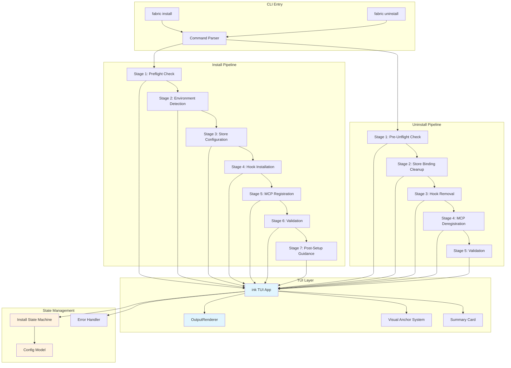
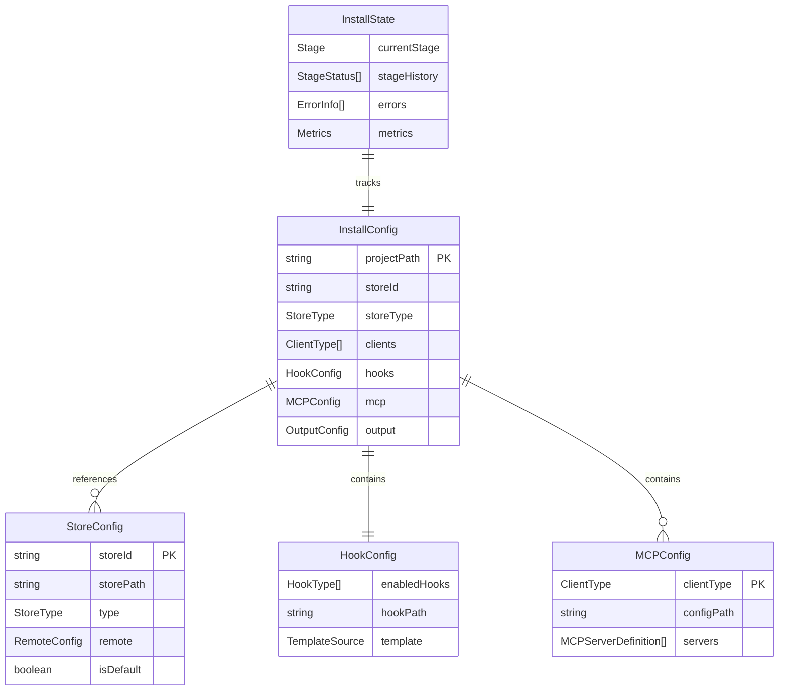

# Fabric CLI Install/Uninstall UX Architecture

## Overview

This document defines the architecture for the refactored Fabric CLI install/uninstall experience, implementing ink-based TUI with a 7-stage install pipeline, store onboarding wizard, and symmetric uninstall flow.

## Component Diagram

## Tech Stack

| Component | Technology | Version | Rationale |
|-----------|------------|---------|-----------|
| TUI Framework | ink | ^4.0.0 | React-based terminal UI, declarative components |
| UI Components | @inkjs/ui | ^2.0.0 | Pre-built accessible components (Select, TextInput, Spinner) |
| State Machine | xstate | ^5.0.0 | Explicit state transitions, visualization support |
| Config Schema | zod | ^3.0.0 | Runtime validation, type inference |
| Output Rendering | chalk | ^5.0.0 | Terminal colors, semantic styling |
| Progress Indication | ora | ^7.0.0 | Spinners, progress bars |
| File Operations | fs-extra | ^11.0.0 | Atomic writes, recursive operations |

## Data Model

## Key Decisions Summary

| ADR | Title | Status |
|-----|-------|--------|
| ADR-001 | Install Pipeline Refactoring | SA-01 Locked |
| ADR-002 | ink TUI Architecture | SA-02 Locked |
| ADR-003 | Output Renderer Unification | SA-04 Locked |
| ADR-004 | Store Onboarding Wizard | UX-01 Locked |
| ADR-005 | Uninstall Symmetry | SA-03 Locked |

## Non-Functional Requirements

| Category | Requirement | Metric |
|----------|-------------|--------|
| Performance | Install completion time | < 30 seconds (default flow) |
| Performance | Stage transition latency | < 500ms |
| Reliability | Graceful degradation | Non-blocking errors allow continuation |
| Reliability | Rollback capability | Failed install leaves clean state |
| Usability | Error message clarity | User-actionable fix in every error |
| Accessibility | Screen reader support | ink focus management |
| Compatibility | Node.js version | >= 18.0.0 |
| Compatibility | Terminal support | All ANSI-256 color terminals |

## Cross-Cutting Concerns

### Observability
- **Metrics**: Stage duration, error rates, completion rates
- **Logging**: Structured JSON logs, correlation IDs per install session
- **Health Checks**: Pre-flight environment validation

### Security
- **File Permissions**: Secure hook file modes (0o755 for scripts)
- **Path Validation**: No path traversal, symlink following restrictions
- **Config Sanitization**: No secrets in output, redacted in logs

### Error Handling
- **Transient**: Retry with exponential backoff (network, file locks)
- **Permanent**: Abort with user-actionable error message
- **Degraded**: Continue with warning, track in state

## References

- **SA-01**: Install pipeline 7-stage design
- **SA-02**: ink TUI architecture decision
- **SA-03**: Uninstall symmetry principle
- **SA-04**: OutputRenderer unified interface
- **UX-01**: Store onboarding wizard design
- **UX-02**: Post-setup guidance patterns
- **UI-01**: Visual anchor system
- **UI-02**: Summary card design