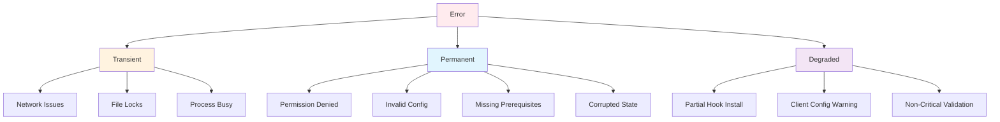
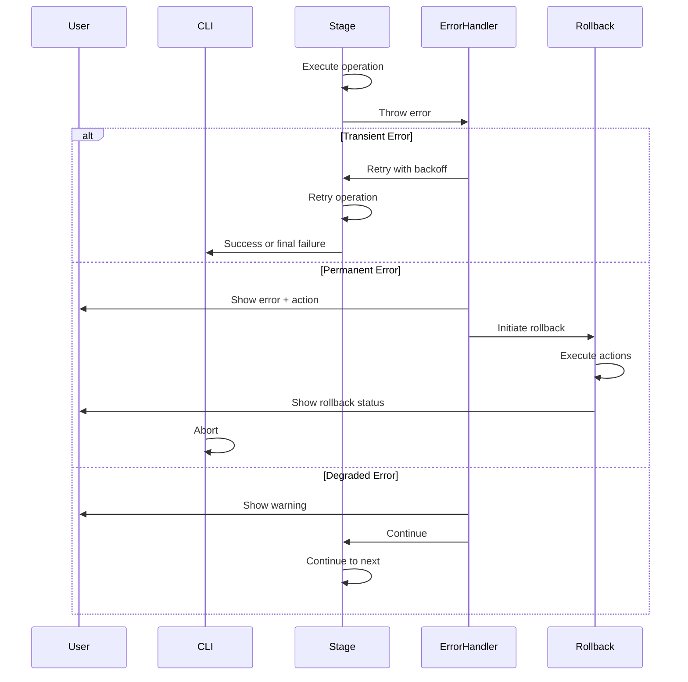

# Error Handling Classification

## Overview

This document defines the error classification system for install/uninstall operations, including error types, handling strategies, recovery actions, and user-facing messages.

## Error Taxonomy



## Error Categories

### 1. Transient Errors (Retry)

Transient errors SHALL be retried with exponential backoff before declaring failure.

| Error Code | Description | Retry Strategy | Max Attempts |
|------------|-------------|----------------|--------------|
| `E_NETWORK_TIMEOUT` | Git clone/push timeout | Backoff: 1s, 2s, 4s | 3 |
| `E_NETWORK_UNREACHABLE` | Remote store unreachable | Backoff: 2s, 4s, 8s | 3 |
| `E_FILE_LOCK` | File locked by process | Backoff: 0.5s, 1s, 2s | 5 |
| `E_PROCESS_BUSY` | MCP server busy | Backoff: 1s, 2s, 4s | 3 |
| `E_RATE_LIMIT` | API rate limit hit | Wait for reset header | 1 |

**Retry Implementation**:

```typescript
async function withRetry<T>(
  fn: () => Promise<T>,
  strategy: RetryStrategy
): Promise<T> {
  const { maxAttempts, backoffMs } = strategy;
  let lastError: Error;
  
  for (let attempt = 0; attempt < maxAttempts; attempt++) {
    try {
      return await fn();
    } catch (error) {
      lastError = error;
      
      if (attempt < maxAttempts - 1) {
        const delay = backoffMs * Math.pow(2, attempt);
        await sleep(delay);
      }
    }
  }
  
  throw new TransientError(lastError, { attempts: maxAttempts });
}
```

### 2. Permanent Errors (Abort)

Permanent errors SHALL abort the operation with actionable user guidance.

| Error Code | Description | User Action | Rollback |
|------------|-------------|-------------|----------|
| `E_PERMISSION_DENIED` | No write permission | `chmod +w <dir>` or run with sudo | Full rollback |
| `E_NODE_VERSION` | Node.js too old | Upgrade to Node.js 18+ | No rollback needed |
| `E_INVALID_PATH` | Invalid store path | Provide valid absolute path | No rollback needed |
| `E_INVALID_URL` | Invalid Git URL | Provide valid HTTPS/SSH URL | No rollback needed |
| `E_DUPLICATE_ID` | Store ID exists | Choose different ID | No rollback needed |
| `E_CONFIG_CORRUPTED` | Client config malformed | Manual repair or delete config | Backup + rollback |
| `E_HOOK_EXISTS` | Non-Fabric hook exists | Manually remove hook | Skip that client |
| `E_NO_CLIENTS` | No clients detected | Install Claude/Cursor/Codex | No rollback needed |

**Error Structure**:

```typescript
interface PermanentError extends Error {
  code: string;
  message: string;
  action: string;
  details?: string;
  cause?: Error;
  
  toJSON(): object {
    return {
      code: this.code,
      message: this.message,
      action: this.action,
      details: this.details,
      cause: this.cause?.message,
    };
  }
}
```

**User-Facing Message Format**:

```
Error: <message>
Action: <user action>
Details: <technical details> (shown with --verbose)
Code: <error code>
```

### 3. Degraded Errors (Continue)

Degraded errors SHALL allow continuation with warning logging.

| Error Code | Description | Handling | User Notification |
|------------|-------------|----------|-------------------|
| `E_HOOK_PARTIAL` | Some hooks failed | Skip failed hooks, continue | Warning in summary |
| `E_MCP_PARTIAL` | Some MCP failed | Skip failed clients, continue | Warning in summary |
| `E_CLIENT_MISSING` | Client dir not found | Skip client, continue | Info message |
| `E_VALIDATION_WARNING` | Non-critical validation | Log warning, continue | Warning in guidance |
| `E_CONFIG_BACKUP` | Config backup failed | Continue without backup | Info message |
| `E_HOOK_TIMEOUT` | Hook took too long | Continue with timeout warning | Warning |

**Degraded Handling**:

```typescript
function handleDegraded(error: DegradedError): DegradedResult {
  logger.warn({
    code: error.code,
    message: error.message,
    stage: currentStage,
    impact: error.impact,
  });
  
  return {
    status: 'degraded',
    error: error,
    continue: true,
    warningMessage: formatWarning(error),
  };
}
```

## Error Classification Matrix

| Stage | Transient | Permanent | Degraded |
|-------|-----------|-----------|----------|
| Preflight | Network timeout | Node version, permissions | Client missing |
| Env Detect | Network timeout | N/A | Client version mismatch |
| Store Config | Git clone timeout | Invalid path/URL, duplicate ID | N/A |
| Hook Install | File lock | Permission denied, hook exists | Hook partial |
| MCP Register | File lock | Permission denied, config corrupted | MCP partial |
| Validation | N/A | Critical check failed | Validation warning |
| Uninstall | File lock | Permission denied | Partial removal |

## Error Message Templates

### Permission Denied

```
Error: Cannot write to directory '<path>'
Action: Run 'chmod +w <path>' or check directory permissions
Details: EACCES: permission denied, open '<path>'
Code: E_PERMISSION_DENIED
```

### Invalid Path

```
Error: Invalid store path '<path>'
Action: Use an absolute path starting with / or ~/
Details: Path must be absolute, parent directory must exist
Code: E_INVALID_PATH
```

### Network Timeout

```
Error: Connection to '<url>' timed out
Action: Check network connection and try again
Details: Request timed out after 30 seconds (attempt 3/3)
Code: E_NETWORK_TIMEOUT
Retry: Exceeded maximum retries, aborting
```

### Hook Exists

```
Error: Non-Fabric hook already exists at '<path>'
Action: Remove existing hook or use --force to overwrite
Details: File contains: '<first line of existing hook>'
Code: E_HOOK_EXISTS
```

### Config Corrupted

```
Error: Client config '<path>' is malformed
Action: Manually repair config or run 'fabric doctor --fix'
Details: JSON parse error at line <n>: <error>
Code: E_CONFIG_CORRUPTED
Backup: Created at '<path>.backup'
```

## Rollback Strategy

### Rollback Actions

| Action | Description | When Used |
|--------|-------------|-----------|
| `restore-file` | Restore file from backup | Config modification failure |
| `restore-dir` | Restore directory from backup | Store creation failure |
| `delete-file` | Delete created file | Hook installation failure |
| `delete-dir` | Delete created directory | Store creation failure |
| `restore-config` | Restore client config | MCP registration failure |
| `remove-binding` | Remove store binding | Store config failure |

### Rollback Implementation

```typescript
interface RollbackManager {
  actions: RollbackAction[];
  
  // Track action during operation
  track(action: RollbackAction): void;
  
  // Execute rollback on failure
  async rollback(): Promise<RollbackResult> {
    const results: RollbackResult[] = [];
    
    // Execute in reverse order
    for (const action of this.actions.reverse()) {
      try {
        const result = await this.executeAction(action);
        results.push({ action, status: 'success', result });
      } catch (error) {
        results.push({ action, status: 'failed', error });
        logger.error(`Rollback action failed: ${action.type}`);
      }
    }
    
    return { actions: results, complete: results.every(r => r.status === 'success') };
  }
  
  private async executeAction(action: RollbackAction): Promise<void> {
    switch (action.type) {
      case 'restore-file':
        await fs.copyFile(action.backup, action.path);
        break;
      case 'delete-file':
        await fs.remove(action.path);
        break;
      case 'delete-dir':
        await fs.remove(action.path);
        break;
      case 'restore-config':
        const config = await fs.readJson(action.backup);
        await fs.writeJson(action.path, config);
        break;
    }
  }
}
```

### Rollback Tracking

```typescript
// During hook installation
async function installHook(hook: HookType, client: ClientType): Promise<void> {
  const hookPath = getHookPath(client, hook);
  
  // Track rollback action before modification
  if (fs.existsSync(hookPath)) {
    rollbackManager.track({
      type: 'restore-file',
      path: hookPath,
      backup: `${hookPath}.backup`,
    });
    await fs.copyFile(hookPath, `${hookPath}.backup`);
  } else {
    rollbackManager.track({
      type: 'delete-file',
      path: hookPath,
    });
  }
  
  // Install hook
  await fs.writeFile(hookPath, hookContent);
}
```

## Error Recovery Flow



## Health Checks

### Pre-flight Health Checks

| Check | Type | Failure Handling |
|-------|------|------------------|
| Node.js version | Permanent | Abort with upgrade message |
| Write permission | Permanent | Abort with chmod message |
| Git installed | Permanent | Abort with install message |
| Network connectivity | Transient | Retry 3 times |
| Disk space | Permanent | Abort with cleanup message |
| Existing .fabric | Warning | Prompt to overwrite |

### Validation Health Checks

| Check | Type | Failure Handling |
|-------|------|------------------|
| Hook files exist | Permanent | Rollback + abort |
| Hook files executable | Degraded | Warning + chmod hint |
| MCP config valid | Permanent | Rollback + abort |
| MCP server responsive | Degraded | Warning + debug hint |
| Store config valid | Permanent | Rollback + abort |
| Store accessible | Permanent | Rollback + abort |

## Logging

### Error Log Format

```typescript
interface ErrorLogEntry {
  timestamp: string;
  level: 'error' | 'warn' | 'info';
  code: string;
  message: string;
  stage: string;
  action?: string;
  details?: string;
  retryCount?: number;
  rollbackActions?: string[];
  sessionId: string;
}
```

### Log Output

```json
{
  "timestamp": "2026-06-06T10:15:30Z",
  "level": "error",
  "code": "E_PERMISSION_DENIED",
  "message": "Cannot write to directory '/project/.claude/hooks'",
  "stage": "hook_install",
  "action": "chmod +w /project/.claude/hooks",
  "details": "EACCES: permission denied",
  "sessionId": "install-20260606101500"
}
```

## References

- **ADR-001**: Pipeline stages
- **ADR-003**: OutputRenderer error formatting
- **ADR-005**: Uninstall rollback
- **state-machine.md**: Error state transitions
- **observability.md**: Error metrics