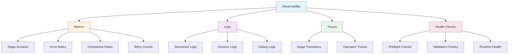

# Observability Specification

## Overview

This document defines the observability framework for install/uninstall operations, including metrics, log events, health checks, and monitoring integration.

## Observability Pillars



## Metrics

### Stage Metrics

| Metric | Type | Description | Tags |
|--------|------|-------------|------|
| `install.stage.duration` | histogram | Time per stage | `stage`, `status` |
| `install.total.duration` | histogram | Total install time | `store_type`, `client_count` |
| `uninstall.stage.duration` | histogram | Time per stage | `stage`, `status` |
| `uninstall.total.duration` | histogram | Total uninstall time | N/A |

### Error Metrics

| Metric | Type | Description | Tags |
|--------|------|-------------|------|
| `install.error.count` | counter | Errors encountered | `stage`, `error_code`, `type` |
| `install.retry.count` | counter | Retry attempts | `stage`, `error_code` |
| `install.rollback.count` | counter | Rollback actions | `action_type` |
| `install.degraded.count` | counter | Degraded warnings | `stage`, `warning_code` |

### Completion Metrics

| Metric | Type | Description | Tags |
|--------|------|-------------|------|
| `install.success.count` | counter | Successful installs | `store_type`, `client_count`, `hook_count` |
| `install.abort.count` | counter | Aborted installs | `reason` |
| `install.cancel.count` | counter | User cancellations | `stage` |
| `uninstall.success.count` | counter | Successful uninstalls | `client_count` |
| `uninstall.abort.count` | counter | Aborted uninstalls | `reason` |

### Usage Metrics

| Metric | Type | Description | Tags |
|--------|------|-------------|------|
| `install.interactive.count` | counter | Interactive mode installs | N/A |
| `install.noninteractive.count` | counter | Non-interactive installs | N/A |
| `install.json.count` | counter | JSON output mode | N/A |
| `install.dryrun.count` | counter | Dry run mode | N/A |
| `wizard.step.count` | counter | Wizard steps completed | `step` |
| `wizard.cancel.count` | counter | Wizard cancellations | `step` |

### Metric Collection

```typescript
interface MetricsCollector {
  // Record metric
  record(metric: MetricRecord): void;
  
  // Get metric snapshot
  snapshot(): MetricsSnapshot;
  
  // Flush to backend
  async flush(): Promise<void>;
}

interface MetricRecord {
  name: string;
  type: 'counter' | 'gauge' | 'histogram';
  value: number;
  tags: Record<string, string>;
  timestamp: number;
}

// Example usage
metricsCollector.record({
  name: 'install.stage.duration',
  type: 'histogram',
  value: stageDuration,
  tags: { stage: 'hook_install', status: 'success' },
  timestamp: Date.now(),
});
```

## Log Events

### Event Schema

```typescript
interface LogEvent {
  // Metadata
  timestamp: string;
  sessionId: string;
  operation: 'install' | 'uninstall';
  stage?: string;
  
  // Event data
  type: string;
  level: 'debug' | 'info' | 'warn' | 'error';
  message: string;
  
  // Structured data
  data?: Record<string, unknown>;
  error?: ErrorInfo;
  
  // Context
  config?: Partial<InstallConfig>;
  metrics?: Partial<MetricRecord>;
}
```

### Install Events

| Event Type | Level | Description | Data |
|------------|-------|-------------|------|
| `install:start` | info | Install initiated | `{ args, config }` |
| `preflight:check` | debug | Preflight check run | `{ check, result }` |
| `preflight:complete` | info | Preflight passed | `{ checks, warnings, duration }` |
| `preflight:warning` | warn | Preflight warning | `{ check, warning }` |
| `preflight:error` | error | Preflight failed | `{ check, error }` |
| `env:client:found` | info | Client detected | `{ client, path, version }` |
| `env:complete` | info | Detection complete | `{ clients, duration }` |
| `store:selected` | info | Store selected | `{ storeId, source }` |
| `store:created` | info | Store created | `{ storeId, path, duration }` |
| `store:connected` | info | Remote store connected | `{ storeId, url, duration }` |
| `wizard:step` | debug | Wizard step | `{ step, choice }` |
| `wizard:complete` | info | Wizard finished | `{ duration }` |
| `hook:installing` | debug | Hook install start | `{ hook, client }` |
| `hook:installed` | info | Hook installed | `{ hook, client, path, duration }` |
| `hook:failed` | warn | Hook install failed | `{ hook, client, error }` |
| `mcp:registering` | debug | MCP registration start | `{ client }` |
| `mcp:registered` | info | MCP registered | `{ client, path, duration }` |
| `mcp:failed` | warn | MCP registration failed | `{ client, error }` |
| `validation:check` | debug | Validation check | `{ check, result }` |
| `validation:complete` | info | Validation passed | `{ checks, duration }` |
| `validation:warning` | warn | Validation warning | `{ check, warning }` |
| `validation:error` | error | Validation failed | `{ check, error }` |
| `guidance:show` | info | Guidance displayed | `{ summary }` |
| `install:complete` | info | Install success | `{ summary, metrics }` |
| `install:abort` | warn | Install aborted | `{ reason, stage }` |
| `rollback:start` | warn | Rollback initiated | `{ actions }` |
| `rollback:action` | debug | Rollback action | `{ action, result }` |
| `rollback:complete` | warn | Rollback done | `{ duration, success }` |
| `error:transient` | warn | Transient error | `{ error, retry, attempt }` |
| `error:permanent` | error | Permanent error | `{ error, action }` |
| `error:degraded` | warn | Degraded error | `{ error, impact }` |

### Uninstall Events

| Event Type | Level | Description | Data |
|------------|-------|-------------|------|
| `uninstall:start` | info | Uninstall initiated | `{ args }` |
| `uninstall:confirmed` | info | User confirmed | `{ }` |
| `uninstall:cancelled` | info | User cancelled | `{ }` |
| `cleanup:binding` | debug | Binding removed | `{ storeId, keptDir }` |
| `cleanup:complete` | info | Cleanup done | `{ duration }` |
| `hook:removing` | debug | Hook removal start | `{ hook, client }` |
| `hook:removed` | info | Hook removed | `{ hook, client, duration }` |
| `hook:failed` | warn | Hook removal failed | `{ hook, client, error }` |
| `mcp:deregistering` | debug | MCP deregistration start | `{ client }` |
| `mcp:deregistered` | info | MCP deregistered | `{ client, duration }` |
| `mcp:failed` | warn | MCP deregistration failed | `{ client, error }` |
| `validation:check` | debug | Validation check | `{ check, result }` |
| `uninstall:complete` | info | Uninstall success | `{ summary, metrics }` |
| `uninstall:abort` | warn | Uninstall aborted | `{ reason, stage }` |

### Log Output Examples

#### Install Success

```json
{
  "timestamp": "2026-06-06T10:00:00Z",
  "sessionId": "install-20260606100000",
  "operation": "install",
  "type": "install:complete",
  "level": "info",
  "message": "Install completed successfully",
  "data": {
    "storeId": "my-team-kb",
    "clients": ["claude", "cursor"],
    "hooks": ["session-start", "pre-tool-use", "post-tool-use"],
    "duration": 28.5
  },
  "metrics": {
    "stageDurations": {
      "preflight": 1.2,
      "env_detect": 0.8,
      "store_config": 15.3,
      "hook_install": 5.1,
      "mcp_register": 3.2,
      "validation": 2.1,
      "guidance": 0.8
    },
    "totalDuration": 28.5
  }
}
```

#### Error Event

```json
{
  "timestamp": "2026-06-06T10:15:30Z",
  "sessionId": "install-20260606101500",
  "operation": "install",
  "stage": "hook_install",
  "type": "error:permanent",
  "level": "error",
  "message": "Cannot write to .claude/hooks/",
  "error": {
    "code": "E_PERMISSION_DENIED",
    "message": "Cannot write to .claude/hooks/",
    "action": "chmod +w .claude/hooks/",
    "details": "EACCES: permission denied"
  }
}
```

## Health Checks

### Preflight Health Checks

| Check ID | Check Name | Critical | Description |
|----------|------------|----------|-------------|
| `H001` | Node version | Yes | Node.js >= 18.0.0 |
| `H002` | Write permission | Yes | Can write to project dir |
| `H003` | Git installed | No | Git binary available |
| `H004` | Network connectivity | No | Can reach internet |
| `H005` | Disk space | Yes | At least 100MB free |
| `H006` | Existing .fabric | No | .fabric/ already exists |

### Validation Health Checks

| Check ID | Check Name | Critical | Description |
|----------|------------|----------|-------------|
| `V001` | Hook files exist | Yes | All hook files present |
| `V002` | Hook files executable | No | Unix: chmod +x set |
| `V003` | MCP config valid | Yes | JSON syntax valid |
| `V004` | MCP server registered | Yes | Fabric server in config |
| `V005` | Store config valid | Yes | store.json readable |
| `V006` | Store accessible | Yes | Can read store files |
| `V007` | MCP server responsive | No | Server responds to ping |

### Runtime Health Checks

| Check ID | Check Name | Interval | Description |
|----------|------------|----------|-------------|
| `R001` | Process alive | 5s | Install process not hung |
| `R002` | Memory usage | 10s | Memory under 500MB |
| `R003` | Disk I/O | 10s | I/O operations proceeding |
| `R004` | Network I/O | 10s | Network operations proceeding |

### Health Check Implementation

```typescript
interface HealthCheck {
  id: string;
  name: string;
  critical: boolean;
  
  async check(): Promise<HealthCheckResult>;
}

interface HealthCheckResult {
  checkId: string;
  status: 'pass' | 'warn' | 'fail';
  message: string;
  details?: string;
  duration: number;
}

async function runHealthChecks(checks: HealthCheck[]): Promise<HealthReport> {
  const results: HealthCheckResult[] = [];
  
  for (const check of checks) {
    const startTime = Date.now();
    try {
      const result = await check.check();
      results.push({
        ...result,
        duration: Date.now() - startTime,
      });
    } catch (error) {
      results.push({
        checkId: check.id,
        status: 'fail',
        message: error.message,
        duration: Date.now() - startTime,
      });
    }
  }
  
  const criticalFailures = results.filter(
    r => r.status === 'fail' && checks.find(c => c.id === r.checkId)?.critical
  );
  
  return {
    results,
    canProceed: criticalFailures.length === 0,
    warnings: results.filter(r => r.status === 'warn'),
    failures: results.filter(r => r.status === 'fail'),
  };
}
```

## Tracing

### Trace Structure

```typescript
interface Trace {
  traceId: string;
  sessionId: string;
  operation: 'install' | 'uninstall';
  
  spans: Span[];
  
  startTime: number;
  endTime: number;
  duration: number;
  status: 'success' | 'error' | 'cancelled';
}

interface Span {
  spanId: string;
  parentSpanId?: string;
  operation: string;
  
  startTime: number;
  endTime: number;
  duration: number;
  
  tags: Record<string, string>;
  logs: SpanLog[];
  status: 'success' | 'error' | 'degraded';
}

interface SpanLog {
  timestamp: number;
  event: string;
  data?: Record<string, unknown>;
}
```

### Trace Example

```json
{
  "traceId": "t-20260606100000",
  "sessionId": "install-20260606100000",
  "operation": "install",
  "startTime": 1717574400000,
  "endTime": 1717574428500,
  "duration": 28500,
  "status": "success",
  "spans": [
    {
      "spanId": "s1",
      "operation": "preflight",
      "startTime": 1717574400000,
      "endTime": 1717574401200,
      "duration": 1200,
      "tags": { "checks": "6" },
      "status": "success",
      "logs": [
        { "timestamp": 1717574400000, "event": "start" },
        { "timestamp": 1717574400500, "event": "check:H001", "data": { "result": "pass" } },
        { "timestamp": 1717574401200, "event": "complete" }
      ]
    },
    {
      "spanId": "s2",
      "operation": "env_detect",
      "parentSpanId": "s1",
      "startTime": 1717574401200,
      "endTime": 1717574402000,
      "duration": 800,
      "tags": { "clients": "2" },
      "status": "success"
    },
    {
      "spanId": "s3",
      "operation": "hook_install",
      "startTime": 1717574423000,
      "endTime": 1717574425100,
      "duration": 2100,
      "tags": { "hooks": "3", "clients": "2" },
      "status": "success",
      "logs": [
        { "timestamp": 1717574423000, "event": "installing:session-start:claude" },
        { "timestamp": 1717574423500, "event": "installed:session-start:claude" },
        { "timestamp": 1717574425100, "event": "complete" }
      ]
    }
  ]
}
```

## Session Log Files

### File Locations

| Log Type | Location | Format |
|----------|----------|--------|
| Session log | `.fabric/.install-{sessionId}.log` | JSONL |
| Debug log | `~/.fabric/logs/debug-{date}.log` | JSONL |
| Error log | `~/.fabric/logs/errors-{date}.log` | JSONL |
| Metrics log | `~/.fabric/logs/metrics-{date}.log` | JSONL |

### Log Rotation

- **Session logs**: Deleted after successful completion, kept for 7 days on failure
- **Debug logs**: Rotated daily, kept for 30 days
- **Error logs**: Rotated daily, kept for 90 days
- **Metrics logs**: Rotated daily, kept for 30 days

### Log Management

```typescript
interface LogManager {
  // Write log entry
  write(entry: LogEvent): void;
  
  // Flush pending logs
  async flush(): Promise<void>;
  
  // Rotate logs
  async rotate(): Promise<void>;
  
  // Clean old logs
  async clean(): Promise<void>;
}

// Auto-flush on stage completion
stageEmitter.on('stage:complete', () => {
  logManager.flush();
});
```

## Dashboard Integration

### Metrics Export

Export metrics for external dashboards (Grafana, Datadog):

```typescript
interface MetricsExporter {
  // Export to Prometheus format
  prometheus(): string;
  
  // Export to JSON
  json(): object;
  
  // Export to StatsD
  statsD(): string[];
}

// Prometheus format example
`
# HELP install_stage_duration Duration of install stages
# TYPE install_stage_duration histogram
install_stage_duration{stage="preflight",status="success"} 1200
install_stage_duration{stage="env_detect",status="success"} 800
install_stage_duration{stage="hook_install",status="success"} 2100

# HELP install_success_count Total successful installs
# TYPE install_success_count counter
install_success_count{store_type="local",client_count="2"} 1
`
```

### Health Check Endpoint

```typescript
// HTTP endpoint for health checks (future feature)
async function healthEndpoint(): Promise<HealthResponse> {
  const checks = await runRuntimeHealthChecks();
  
  return {
    status: checks.canProceed ? 'healthy' : 'unhealthy',
    checks: checks.results,
    timestamp: new Date().toISOString(),
  };
}
```

## Debug Bundle

### Bundle Contents

When `--debug-bundle` flag is set, create diagnostic bundle:

```
.fabric-debug-{sessionId}.zip
├── install-state.json      # Current state
├── session.log             # Full session log
├── config.json             # Install configuration
├── environment.json        # Detected environment
├── metrics.json            # All metrics
├── trace.json              # Full trace
├── rollback.json           # Rollback stack
└── error-context.json      # Error details (if failed)
```

### Bundle Creation

```typescript
async function createDebugBundle(sessionId: string): Promise<string> {
  const bundlePath = `.fabric-debug-${sessionId}.zip`;
  
  const files = [
    { name: 'install-state.json', content: state.toJSON() },
    { name: 'session.log', content: sessionLog },
    { name: 'config.json', content: config.toJSON() },
    { name: 'environment.json', content: envReport },
    { name: 'metrics.json', content: metricsCollector.snapshot() },
    { name: 'trace.json', content: trace.toJSON() },
    { name: 'rollback.json', content: rollbackStack },
  ];
  
  if (state.error) {
    files.push({ name: 'error-context.json', content: errorReport });
  }
  
  await createZip(bundlePath, files);
  return bundlePath;
}
```

## References

- **ADR-001**: Pipeline stages
- **ADR-003**: OutputRenderer logging
- **state-machine.md**: State events
- **error-handling.md**: Error logging