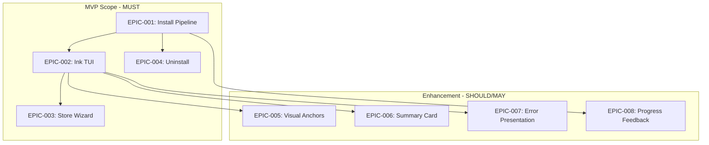

# Fabric CLI Install/Uninstall UX Refactoring - Epic Index

## Overview

Blueprint ID: BLP-fabric-install-ux-ink-tui-2026-06-06
Created: 2026-06-06
MVP Scope: F-001 + F-002 + F-003 + F-004 (all MUST features)

## Epic Summary Table

| Epic ID | Name | Features | Priority | Stories | Est. Size |
|---------|------|----------|----------|---------|-----------|
| EPIC-001 | Install Pipeline Refactor | F-001 | MUST | 4 | M |
| EPIC-002 | Ink TUI Output Layer | F-002 | MUST | 4 | M |
| EPIC-003 | Store Onboarding Wizard | F-003 | MUST | 4 | L |
| EPIC-004 | Uninstall Symmetry | F-004 | MUST | 3 | S |
| EPIC-005 | Visual Anchor System | F-005 | SHOULD | 3 | S |
| EPIC-006 | Summary Card | F-006 | SHOULD | 2 | S |
| EPIC-007 | Error Presentation | F-007 | SHOULD | 3 | S |
| EPIC-008 | Progress Feedback | F-008 | MAY | 2 | XS |

**Total**: 8 Epics, 25 Stories

## Dependency Graph (Mermaid)

## MVP Scope

### Phase 1: Core Infrastructure (Week 1-2)
1. **EPIC-001**: Install Pipeline Refactor
2. **EPIC-002**: Ink TUI Output Layer

### Phase 2: User-Facing Features (Week 2-3)
3. **EPIC-003**: Store Onboarding Wizard
4. **EPIC-004**: Uninstall Symmetry

### Phase 3: Polish & Enhancement (Week 4)
5. **EPIC-005**: Visual Anchor System
6. **EPIC-006**: Summary Card
7. **EPIC-007**: Error Presentation
8. **EPIC-008**: Progress Feedback

## Execution Order

| Order | Epic | Rationale |
|-------|------|-----------|
| 1 | EPIC-001 | Core foundation - all other epics depend on install pipeline |
| 2 | EPIC-002 | Output layer - provides Ink components for all UI |
| 3 | EPIC-008 | Progress Feedback | Small, low-risk, integrates with EPIC-001/002 |
| 4 | EPIC-004 | Uninstall | Mirrors install flow, minimal dependencies |
| 5 | EPIC-003 | Store Wizard | Complex, depends on EPIC-001 and EPIC-002 |
| 6 | EPIC-005 | Visual Anchors | Enhances EPIC-002 output |
| 7 | EPIC-006 | Summary Card | Enhances EPIC-002 output |
| 8 | EPIC-007 | Error Presentation | Enhances EPIC-002 output |

## Feature-to-Epic Mapping

| Feature | Epic | MVP |
|---------|------|-----|
| F-001: Install Stage Refactor | EPIC-001 | Yes |
| F-002: Ink Output Layer | EPIC-002 | Yes |
| F-003: Store Onboarding Wizard | EPIC-003 | Yes |
| F-004: Uninstall Symmetry | EPIC-004 | Yes |
| F-005: Visual Anchor System | EPIC-005 | No |
| F-006: Summary Card | EPIC-006 | No |
| F-007: Error Presentation | EPIC-007 | No |
| F-008: Progress Feedback | EPIC-008 | No |

## Traceability Matrix

| Story | REQ | Feature | Epic |
|-------|-----|---------|------|
| STORY-001-A | REQ-001 | F-001 | EPIC-001 |
| STORY-001-B | REQ-002 | F-001 | EPIC-001 |
| STORY-001-C | REQ-003 | F-001 | EPIC-001 |
| STORY-001-D | REQ-004 | F-001 | EPIC-001 |
| STORY-002-A | REQ-005 | F-002 | EPIC-002 |
| STORY-002-B | REQ-006 | F-002 | EPIC-002 |
| STORY-002-C | REQ-007 | F-002 | EPIC-002 |
| STORY-002-D | REQ-008 | F-002 | EPIC-002 |
| STORY-003-A | REQ-009 | F-003 | EPIC-003 |
| STORY-003-B | REQ-010 | F-003 | EPIC-003 |
| STORY-003-C | REQ-011 | F-003 | EPIC-003 |
| STORY-003-D | REQ-012 | F-003 | EPIC-003 |
| STORY-004-A | REQ-013 | F-004 | EPIC-004 |
| STORY-004-B | REQ-014 | F-004 | EPIC-004 |
| STORY-004-C | REQ-015 | F-004 | EPIC-004 |
| STORY-005-A | REQ-016 | F-005 | EPIC-005 |
| STORY-005-B | REQ-017 | F-005 | EPIC-005 |
| STORY-005-C | REQ-018 | F-005 | EPIC-005 |
| STORY-006-A | REQ-019 | F-006 | EPIC-006 |
| STORY-006-B | REQ-020 | F-006 | EPIC-006 |
| STORY-007-A | REQ-021 | F-007 | EPIC-007 |
| STORY-007-B | REQ-022 | F-007 | EPIC-007 |
| STORY-007-C | REQ-023 | F-007 | EPIC-007 |
| STORY-008-A | REQ-024 | F-008 | EPIC-008 |
| STORY-008-B | REQ-025 | F-008 | EPIC-008 |