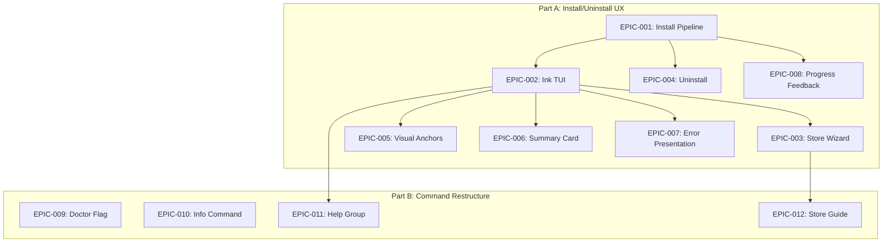

# Milestone: v2.2.0-rc.5 CLI UX Complete

> **合并方案**: BLP-fabric-install-ux-ink-tui + BLP-fabric-cli-command-restructure
> **目标**: 完整实现所有功能，不留 deferred 项
> **版本**: v2.2.0-rc.5

---

## 一、里程碑范围

### 来源方案

| 方案 ID | 名称 | EPIC 数量 | 状态 |
|---------|------|----------|------|
| BLP-fabric-install-ux-ink-tui-2026-06-06 | Install/Uninstall UX | 8 EPICs | Blueprint 完成 (91分) |
| BLP-fabric-cli-command-restructure-2026-06-06 | 命令层级重构 | 4 EPICs (新增) | 方案完成 |

**合并后总计**: 12 EPICs, ~30 Stories

### 功能分组

```
┌─────────────────────────────────────────────────────────────────┐
│                    v2.2.0-rc.5 CLI UX Complete                   │
├─────────────────────────────────────────────────────────────────┤
│                                                                 │
│  Part A: Install/Uninstall UX (BLP-fabric-install-ux-ink-tui)  │
│  ├─ EPIC-001: Install Pipeline Refactor                        │
│  ├─ EPIC-002: Ink TUI Output Layer                              │
│  ├─ EPIC-003: Store Onboarding Wizard                           │
│  ├─ EPIC-004: Uninstall Symmetry                                │
│  ├─ EPIC-005: Visual Anchor System                              │
│  ├─ EPIC-006: Summary Card                                      │
│  ├─ EPIC-007: Error Presentation                                │
│  └─ EPIC-008: Progress Feedback                                 │
│                                                                 │
│  Part B: Command Layer Restructure (NEW)                        │
│  ├─ EPIC-009: Doctor Flag Hidden                                │
│  ├─ EPIC-010: Info Command Unified                              │
│  ├─ EPIC-011: Help Group Display                                │
│  └─ EPIC-012: Store Guide Optimization                          │
│                                                                 │
└─────────────────────────────────────────────────────────────────┘
```

---

## 二、Part B: Command Layer Restructure EPICs

### EPIC-009: Doctor Flag Hidden

**Feature**: F-009 Doctor Flag 分层暴露
**Priority**: MUST
**Est. Size**: S

**Stories**:
- STORY-009-A: 将内部/报告类 flag 设为 hidden
- STORY-009-B: 互斥模式验证 (fix vs fix-entries)
- STORY-009-C: 更新 doctor --help 输出

**Scope**:
```typescript
// packages/cli/src/commands/doctor.ts
hidden flags: cite-coverage, archive-history, lint-conflicts, debug-bundle, deep
暴露 flags: fix, fix-entries, json, verbose, target
```

**Done When**:
- `fabric doctor --help` 不显示 hidden flags
- 测试验证所有 flag 功能仍正常

---

### EPIC-010: Info Command Unified

**Feature**: F-010 合并 whoami/status/scope-explain
**Priority**: MUST
**Est. Size**: M

**Stories**:
- STORY-010-A: 创建 `fabric info` 命令
- STORY-010-B: 实现 `info --global` (替代 whoami)
- STORY-010-C: 实现 `info scope <path>` (替代 scope-explain)
- STORY-010-D: 添加废弃警告到旧命令

**Scope**:
```
fabric info              → 显示项目状态 (原 status)
fabric info --global     → 显示全局身份 (原 whoami)
fabric info scope <path> → 解释 scope 解析 (原 scope-explain)
```

**Done When**:
- 新命令 `fabric info` 可用
- `whoami/status/scope-explain` 输出废弃警告但仍工作
- 测试覆盖所有路径

---

### EPIC-011: Help Group Display

**Feature**: F-011 --help 分组显示
**Priority**: SHOULD
**Est. Size**: S

**Stories**:
- STORY-011-A: 实现 --help 分组输出 (Setup/Daily/Diagnostic/Advanced)
- STORY-011-B: 添加 "First time?" 引导行
- STORY-011-C: 支持隐藏废弃命令 (可选)

**Scope**:
```
fabric --help
First time? Run: fabric install

Setup:
  install     Initialize Fabric
  config      Configure settings

Daily:
  sync        Sync team knowledge
  info        Show status

Diagnostic:
  doctor      Check health

Advanced:
  store       Manage stores
```

**Done When**:
- `fabric --help` 显示分组结构
- 新用户能立即知道第一步

---

### EPIC-012: Store Guide Optimization

**Feature**: F-012 store 子命令分组引导
**Priority**: SHOULD
**Est. Size**: S

**Stories**:
- STORY-012-A: 优化 `fabric store --help` 分组显示
- STORY-012-B: 添加 "First time creating?" 引导

**Scope**:
```
fabric store --help
Viewing:
  list, project-list

Mounting:
  create, add, bind

Modifying:
  remove, switch

Migration (advanced):
  migrate, promote, rescope

First time? Run: fabric store create <alias>
```

**Done When**:
- store --help 显示分组
- 用户能区分 create vs add vs bind

---

## 三、依赖关系



**关键依赖**:
- EPIC-011 (Help Group) 需要 EPIC-002 (Ink TUI) 的输出层支持
- EPIC-012 (Store Guide) 与 EPIC-003 (Store Wizard) 功能相关

---

## 四、执行计划

### Phase 1: Core Infrastructure (Week 1-2)

| EPIC | 名称 | 优先级 | 工作量 |
|------|------|--------|--------|
| EPIC-001 | Install Pipeline | MUST | M |
| EPIC-002 | Ink TUI Output | MUST | M |
| EPIC-009 | Doctor Flag Hidden | MUST | S |

### Phase 2: User-Facing Features (Week 2-3)

| EPIC | 名称 | 优先级 | 工作量 |
|------|------|--------|--------|
| EPIC-010 | Info Command | MUST | M |
| EPIC-003 | Store Wizard | MUST | L |
| EPIC-004 | Uninstall | MUST | S |

### Phase 3: Polish & Enhancement (Week 4)

| EPIC | 名称 | 优先级 | 工作量 |
|------|------|--------|--------|
| EPIC-011 | Help Group | SHOULD | S |
| EPIC-012 | Store Guide | SHOULD | S |
| EPIC-005 | Visual Anchors | SHOULD | S |
| EPIC-006 | Summary Card | SHOULD | S |
| EPIC-007 | Error Presentation | SHOULD | S |
| EPIC-008 | Progress Feedback | MAY | XS |

---

## 五、执行方式

### Worktree 开发

```bash
# 创建 worktree
git worktree add .claude/worktrees/v2.2.0-rc.5-cli-ux -b feature/v2.2.0-rc.5-cli-ux

# 在 worktree 中开发
cd .claude/worktrees/v2.2.0-rc.5-cli-ux

# 完成后合并
git checkout main
git merge feature/v2.2.0-rc.5-cli-ux
git worktree remove .claude/worktrees/v2.2.0-rc.5-cli-ux
```

### 不留 Deferred

**原则**: 每个 EPIC 完成后立即测试验证，不 deferred 任何功能。

**验收标准**:
- 所有 MUST 功能 100% 完成
- 所有 SHOULD 功能 100% 完成
- MAY 功能按实际情况决定
- 测试覆盖率 ≥ 80%
- `fabric doctor` 通过

---

## 六、发布

### 版本号

```
v2.2.0-rc.5
```

### CHANGELOG

```markdown
## v2.2.0-rc.5 - CLI UX Complete

### Features

#### Install/Uninstall UX
- 7-stage install pipeline with Ink TUI
- Store onboarding wizard (Skip/Join/Create)
- Uninstall symmetry cleanup
- Visual anchor system
- Summary card
- Error recovery-first presentation
- Progress feedback

#### Command Layer Restructure
- Doctor flag hidden (15→5 exposed flags)
- New `fabric info` command (合并 whoami/status/scope-explain)
- Grouped --help display (Setup/Daily/Diagnostic/Advanced)
- Store subcommand guide optimization

### Migration
- `whoami` → `fabric info --global` (废弃警告)
- `status` → `fabric info` (废弃警告)
- `scope-explain` → `fabric info scope` (废弃警告)
```

---

## 七、下一步

1. `/maestro-ralph "创建 worktree，从 milestone 文档开始执行 Phase 1"`
2. 或直接用 `/EnterWorktree` 进入隔离环境开发